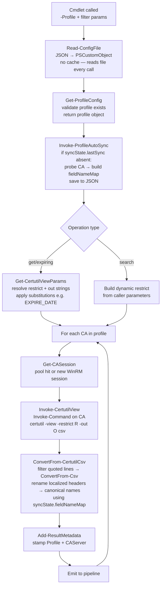
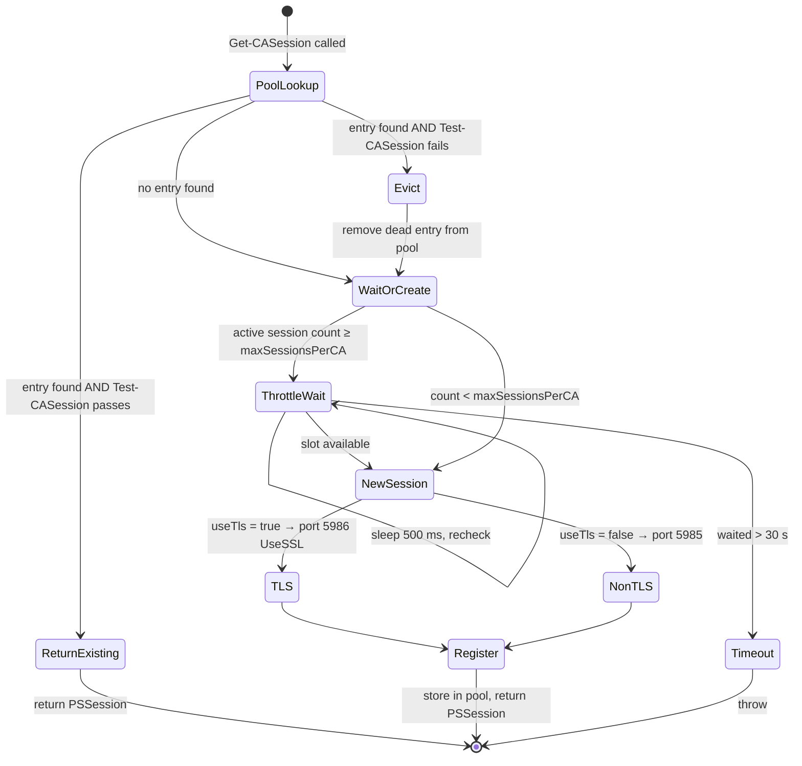
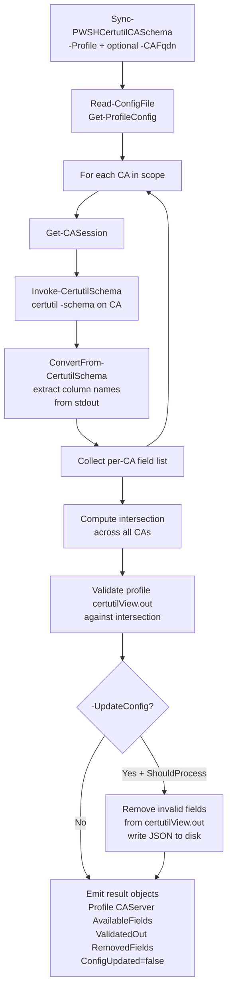
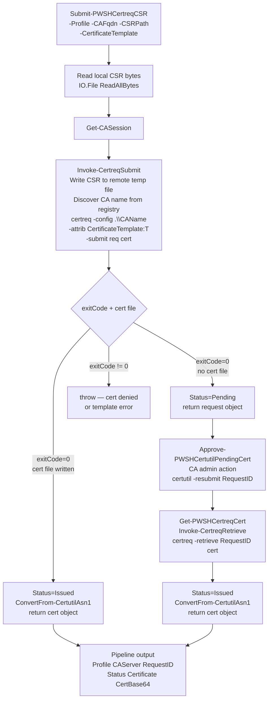

# Architecture — Posh-Certutil

## Overview

Posh-Certutil is a Windows PowerShell module that wraps `certutil.exe` and uses WinRM
(PowerShell Remoting) to execute certutil commands **locally** on each CA server, then
aggregates and surfaces the results as typed PowerShell objects. No certutil is ever run
on the management machine.

---

## Module structure

```
Posh-Certutil/
├── Posh-Certutil.psd1              # Module manifest
├── Posh-Certutil.psm1              # Generic loader (no business logic)
├── Config/
│   └── Posh-Certutil.json          # Embedded configuration — profiles + certutil view params
├── Public/                          # One exported cmdlet per file
│   ├── Get-PWSHCertutilConfig.ps1
│   ├── Set-PWSHCertutilConfig.ps1
│   ├── Get-PWSHCertutilIssuedCerts.ps1
│   ├── Get-PWSHCertutilRevokedCerts.ps1
│   ├── Get-PWSHCertutilShortTermExpiringCerts.ps1
│   ├── Get-PWSHCertutilCertStatus.ps1
│   ├── Search-PWSHCertutilCerts.ps1
│   ├── Show-PWSHCertutilCerts.ps1
│   ├── Revoke-PWSHCertutilIssuedCerts.ps1
│   ├── Publish-PWSHCertutilCACrl.ps1
│   ├── Sync-PWSHCertutilCASchema.ps1
│   ├── Submit-PWSHCertreqCSR.ps1        # certreq -submit via WinRM
│   ├── Get-PWSHCertreqCert.ps1          # certreq -retrieve via WinRM
│   └── Approve-PWSHCertutilPendingCert.ps1 # certutil -resubmit (CA manager approval)
├── Private/
│   ├── Config/
│   │   ├── Read-ConfigFile.ps1          # JSON → PSCustomObject (no cache)
│   │   ├── Get-ProfileConfig.ps1        # Validate + return one profile
│   │   ├── Get-CertutilViewParams.ps1   # Resolve restrict + out with substitutions
│   │   └── Invoke-ProfileAutoSync.ps1   # Auto-sync field name map if syncState absent
│   ├── Session/
│   │   ├── Get-CASession.ps1            # Pool lookup or new WinRM session
│   │   ├── Remove-CASession.ps1         # Evict + close one session
│   │   └── Test-CASession.ps1           # Liveness probe
│   ├── Certutil/
│   │   ├── Invoke-CertutilView.ps1      # certutil -view remotely, return stdout lines
│   │   ├── ConvertFrom-CertutilCsv.ps1  # Filter + ConvertFrom-Csv + localized column rename
│   │   ├── Invoke-CertutilRevoke.ps1    # certutil -revoke remotely
│   │   ├── Invoke-CertutilCrl.ps1       # certutil -crl + download CRL bytes
│   │   ├── ConvertFrom-CertutilAsn1.ps1 # X509Certificate2 / certutil -dump → PSObject
│   │   ├── Invoke-CertutilSchema.ps1    # certutil -schema remotely, return stdout lines
│   │   ├── ConvertFrom-CertutilSchema.ps1 # Parse schema output → column name array
│   │   ├── Invoke-CertutilResubmit.ps1  # certutil -resubmit (approve pending request)
│   │   ├── Invoke-CertreqSubmit.ps1     # certreq -submit remotely, transfer CSR bytes
│   │   ├── Invoke-CertreqRetrieve.ps1   # certreq -retrieve remotely, return cert bytes
│   │   └── Get-CertutilFieldNameMap.ps1 # Probe query to map localized→canonical column names
│   └── Output/
│       └── Add-ResultMetadata.ps1       # Stamp Profile + CAServer on each object
├── Docs/                                # Markdown + Mermaid documentation (this folder)
└── Tests/                               # Pester test scripts
```

---

## Module loader

`Posh-Certutil.psm1` contains zero business logic. It:

1. Declares the module-scoped session pool (`$script:SessionPool` — a `ConcurrentDictionary`).
2. Dot-sources all `Private/**/*.ps1` files recursively.
3. Dot-sources all `Public/*.ps1` files and calls `Export-ModuleMember` for each.
4. Registers an `OnRemove` handler that closes all pooled WinRM sessions when the module is removed.

The session pool is `$script:` (module-scoped), not `$global:`. It is invisible to the caller's scope.

---

## Data pipeline



### Key invariant

`certutil -view` is run **on the CA itself** via `Invoke-Command`. The CA database is local to the CA process — no `-config CAserver\CAname` is needed. stdout is captured directly; no temp files are written on the CA.

---

## Session management



Pool key: `"fqdn:port"`. One entry per CA. Sessions are reused across cmdlet calls within the same module lifecycle. All sessions are closed when the module is removed (`OnRemove` handler).

---

## Output object contract

Every get/search cmdlet emits objects with this minimum shape:

| Property | Type | Source |
|---|---|---|
| `Profile` | `string` | stamped by `Add-ResultMetadata` |
| `CAServer` | `string` | stamped by `Add-ResultMetadata` |
| `RequestID` | `string` | certutil -out field |
| *(other fields)* | `string` | certutil -out fields per profile config |

Pipeline-aware cmdlets (`Show-`, `Get-CertStatus`, `Revoke-`) extract `Profile`, `CAServer`, and `RequestID` from the piped object automatically. The caller does not re-specify these.

### Extended output — `Show-PWSHCertutilCerts` and `Get-PWSHCertutilCertStatus`

These cmdlets add:

| Property | Content |
|---|---|
| `Certificate` | `PSCustomObject` decoded from `X509Certificate2` (Subject, Issuer, NotBefore, NotAfter, Thumbprint, Extensions) |

### Extended output — `Publish-PWSHCertutilCACrl`

| Property | Content |
|---|---|
| `CrlBase64` | Raw CRL bytes as Base64 string |
| `CRLDecoded` | `PSCustomObject` from `certutil -dump` on the CRL file |

---

## Configuration dynamic loading

`restrict` and `out` values are read from the JSON config at **each cmdlet invocation** via `Read-ConfigFile → Get-CertutilViewParams`. There is no in-memory cache. This means editing the JSON file takes effect on the next cmdlet call without reloading the module.

`Search-PWSHCertutilCerts` bypasses the profile `restrict.search` template entirely and builds the restrict string dynamically from caller parameters at runtime; it still reads `out.search` from the profile.

---

## Schema discovery — Sync-PWSHCertutilCASchema

`Sync-PWSHCertutilCASchema` is the recommended first step when pointing the module at a new CA environment. It runs `certutil -schema` on every CA in the profile via WinRM and returns the available database column names.



**Key behaviour:**
- Returns one object per CA, each with `Profile`, `CAServer`, `AvailableFields`, `FieldCount`, `SchemaConflicts`, `ValidatedOut`, `RemovedFields`, and `ConfigUpdated`.
- When multiple CAs are queried, validation uses the **intersection** of their schemas so the config works on every CA in the profile.
- **Schema mismatch detection**: after collecting all per-CA field lists, the cmdlet compares them pairwise. Any field that is not present on every CA is a conflict. A `Write-Warning` is emitted for each conflicting field, naming both the CAs that have it and those that don't. `SchemaConflicts` is a `PSCustomObject` whose properties are the conflicting field names; each value is the array of CA FQDNs that expose that field. An empty `SchemaConflicts` means all queried CAs share an identical schema.
- Supports `-WhatIf` — shows what would be removed without writing the file.

## Certutil field name notes

Certutil `-out` field names are determined by the CA database schema. The defaults in `Config/Posh-Certutil.json` use the most common schema column names. **These must be validated against each target CA environment** — some columns (e.g., `RequesterName` vs. `Request.RequesterName`) vary by CA version and configuration.

Use `Sync-PWSHCertutilCASchema -Profile '<name>' -UpdateConfig` to automatically remove invalid field names from the profile's `out` arrays and write the corrected config back to JSON.

Reference: sysadmins.lv disposition values and out field documentation (see README links).

---

## Certutil / certreq error handling

All certutil invocations check the stdout output for the standard failure pattern `CertUtil:.*command FAILED` and throw a descriptive exception if found. certreq invocations check `$LASTEXITCODE` (non-zero = failure) and whether the output certificate file was written. This ensures failures are surfaced as errors rather than silently returning empty results.

| Function | Stderr | Failure check | Location |
|---|---|---|---|
| `Invoke-CertutilView` | `2>$null` (suppressed) | stdout FAILED pattern after `Invoke-Command` | outside scriptblock — unit-testable |
| `Invoke-CertutilSchema` | `2>$null` (suppressed) | stdout FAILED pattern after `Invoke-Command` | outside scriptblock — unit-testable |
| `Invoke-CertutilRevoke` | `2>&1` (captured) | stdout FAILED pattern after `Invoke-Command` | outside scriptblock — unit-testable |
| `Invoke-CertutilResubmit` | `2>&1` (captured) | stdout FAILED pattern after `Invoke-Command` | outside scriptblock — unit-testable |
| `Invoke-CertutilCrl` | `2>&1` (captured) | stdout FAILED pattern inside `$sb` remote scriptblock | fires on the CA; exception propagates via `Invoke-Command -ErrorAction Stop` |
| `ConvertFrom-CertutilAsn1` (CRL) | `2>&1` (captured) | stdout FAILED pattern after local `certutil -dump` | outside scriptblock — testable at integration level |
| `Invoke-CertreqSubmit` | `2>&1` (captured) | `$LASTEXITCODE` + cert file existence inside `$sb` | remote scriptblock returns structured PSCustomObject; throw happens outside scriptblock |
| `Invoke-CertreqRetrieve` | `2>&1` (captured) | `$LASTEXITCODE` + cert file existence inside `$sb` | same as above |

When a failure exception propagates to a public cmdlet's `try/catch`, the cmdlet calls `Write-Error`. No output object is emitted for that operation.

---

## Certificate request pipeline — certreq integration

Three cmdlets cover the full lifecycle of submitting an externally-created CSR to an ADCS CA:



**Key design notes:**

- `Submit-PWSHCertreqCSR` targets **one specific CA** (not all CAs in a profile). CSR submission is a targeted operation. `CAFqdn` is mandatory and must be in the profile.
- The CA name used in the certreq `-config` parameter is discovered dynamically at runtime from `HKLM:\SYSTEM\CurrentControlSet\Services\CertSvc\Configuration` → `Active` value. This avoids storing the CA common name in the JSON config.
- CSR bytes are transferred to the remote CA via `Invoke-Command -ArgumentList` (WinRM serialisation), written to a temp file, and cleaned up in a `finally` block. No permanent files are left on the CA.
- Status is determined entirely by `$LASTEXITCODE` and whether the output certificate file was written — not by string matching on certreq's localised output.
- The returned object carries `Profile`, `CAServer`, and `RequestID`, making it directly pipeable to `Approve-PWSHCertutilPendingCert` and `Get-PWSHCertreqCert`.

**Typical pending-approval workflow:**

```powershell
# 1. Submit (auto-issued or pending depending on template configuration)
$req = Submit-PWSHCertreqCSR -Profile 'prod-pki' -CAFqdn 'ca01.corp.local' `
           -CSRPath 'C:\requests\server.req' -CertificateTemplate 'ManualApproval'

# 2. CA manager approves (certutil -resubmit on the CA)
$req | Approve-PWSHCertutilPendingCert -Confirm:$false

# 3. Requestor retrieves the issued certificate (certreq -retrieve on the CA)
$req | Get-PWSHCertreqCert -OutputCertPath 'C:\certs\server.cer'
```

---

## ASN.1 decoding strategy

| Input | Method | PS version |
|---|---|---|
| Certificate bytes | `System.Security.Cryptography.X509Certificates.X509Certificate2` | 5.1+ |
| CRL bytes | `certutil -dump <tempfile>` parsed as raw text | 5.1+ |

A structured CRL decoder (e.g., `X509CertificateRevocationList` in .NET 7+) can replace the certutil-dump approach when PS 7.4+ is a guaranteed baseline.
