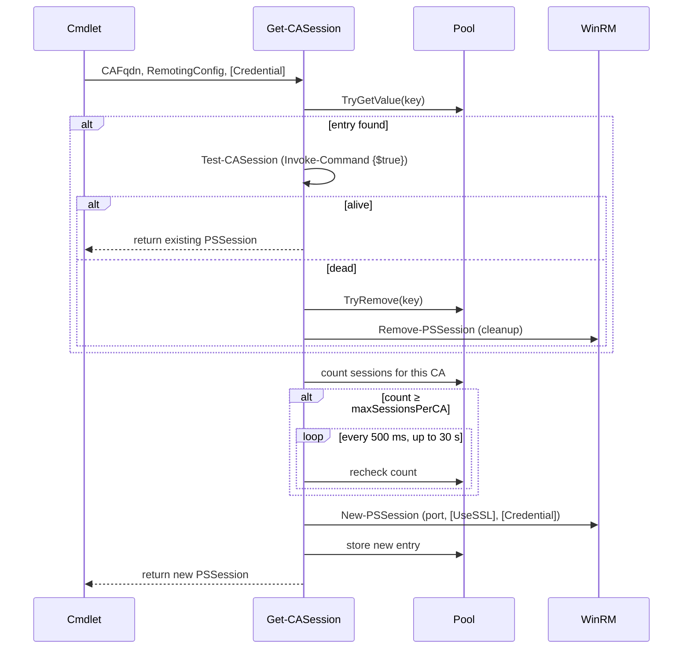

# Session Management — Posh-Certutil

## Design goals

1. Reuse WinRM sessions across cmdlet calls to avoid reconnection overhead.
2. Detect and replace dead sessions transparently.
3. Cap concurrent sessions per CA to avoid overloading CA servers.
4. Clean up all sessions when the module is removed.

---

## Session pool

The pool is a `ConcurrentDictionary[string, object]` stored as `$script:SessionPool` in the module scope. It is invisible to callers (`$global:` is never used).

**Pool key:** `"fqdn:port"` — one entry per CA endpoint.

**Pool entry shape:**

```powershell
[PSCustomObject]@{
    Session  = <PSSession>
    CAFqdn   = <string>
    LastUsed = <datetime UTC>
}
```

---

## Session lifecycle



---

## Liveness probe

`Test-CASession` runs `Invoke-Command -Session $Session { $true }` inside a try/catch. If the command throws for any reason (broken state, closed, network drop), the session is considered dead and `$false` is returned. No pre-check on `$Session.State` is performed — `Invoke-Command` already throws for any non-functioning state, making a separate state check redundant. This probe runs on every pool hit before the session is returned, ensuring callers always get a working session.

---

## Throttling

`maxSessionsPerCA` is read from the profile's `remoting` configuration. `Get-CASession` counts all pool keys matching `"fqdn:*"` and blocks in a 500 ms polling loop until a slot is available or the 30-second deadline is exceeded.

For typical single-threaded cmdlet use (iterating over CAs one at a time), throttling is rarely triggered. It protects against scenarios where multiple concurrent PowerShell runspaces use the same module.

---

## Session cleanup

The `Posh-Certutil.psm1` `OnRemove` handler iterates all pool entries and calls `Remove-PSSession` on each:

```powershell
$MyInvocation.MyCommand.ScriptBlock.Module.OnRemove = {
    $script:SessionPool.Values | ForEach-Object {
        Remove-PSSession -Session $_.Session -ErrorAction SilentlyContinue
    }
    $script:SessionPool.Clear()
}
```

This fires on `Remove-Module Posh-Certutil` or when the PowerShell session exits.

---

## TLS vs non-TLS

Set `useTls` in the profile's `remoting` block:

| `useTls` | Default port | `New-PSSession` flags |
|---|---|---|
| `true` | `5986` | `-UseSSL` |
| `false` | `5985` | (none) |

For TLS to work, the CA must have a valid WinRM HTTPS listener configured and the management machine must trust the CA's certificate.

---

## Credential handling

If `-Credential` is passed to a public cmdlet, it is forwarded to `Get-CASession` and then to `New-PSSession`. If omitted, the current user's identity is used (Kerberos/NTLM, depending on environment). Credential is not stored in the pool entry — if the session dies and is recreated, the caller must pass `-Credential` again.
